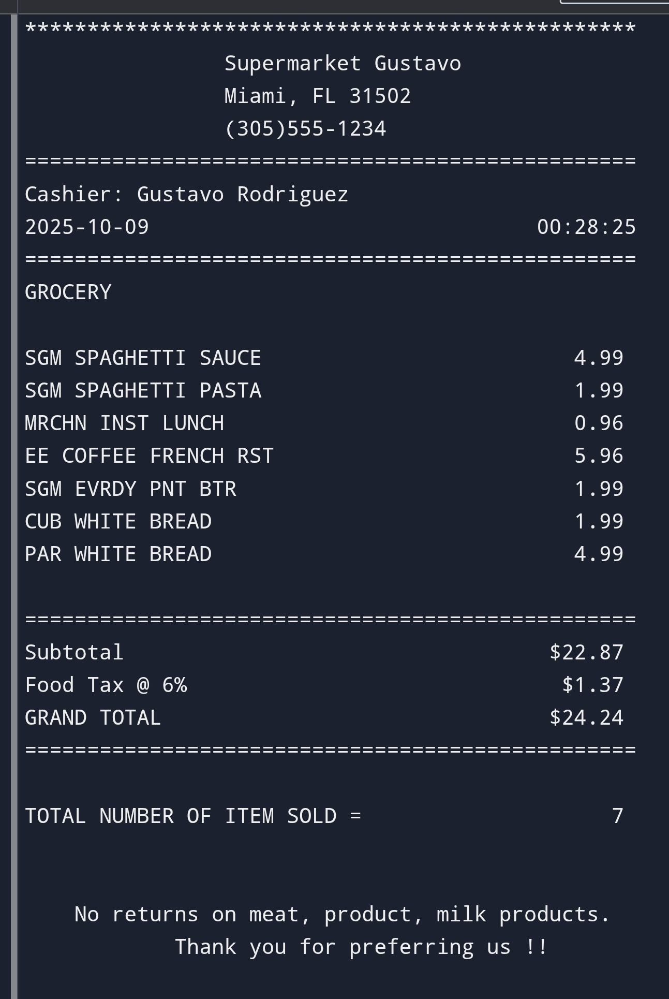

# # Payment Receipt Generator

A simple Python script to automate the creation of payment receipts, designed for beginners and applicable to ecommerce or IT support workflows. This project showcases basic programming skills and automation, aligning with my experience in IT support and digital marketing.

## Description
This tool allows users to input details such as customer name, product name, and payment amount, then generates a text-based receipt saved as a `.txt` file. It’s a practical solution for automating receipt generation in small-scale ecommerce or dropshipping operations, reducing manual errors—a skill I learned during my IT support roles. The project can be extended with CSV logging or basic database integration for future enhancements.

## Technologies Used
- **Python 3**: Core language for script development (no external libraries required).
- **Text File Handling**: Built-in file I/O for saving receipts.

## How to Run
1. **Install Python**: Download and install Python from [python.org](https://www.python.org/) if not already installed.
2. **Download the Code**: Clone or download this repository to your local machine.
3. **Navigate to the Folder**: Open a terminal or Command Prompt and navigate to the project folder (`cd path/to/payment-receipt-generator`).
4. **Run the Script**: Type `python receipt_generator.py` and press Enter.
5. **Follow Prompts**: Enter the required details (e.g., name, product, amount) as instructed—the receipt will be saved automatically.

## Screenshots
  
*(Example: The terminal showing the script running and prompting for user input.)*

  
*(Example: A sample receipt file opened in a text editor.)*

*Note: Upload your own screenshots to the repository and update the file names in the links above (e.g., replace `screenshot1.png` with your actual file name).*

## Future Improvements
- Add support for PDF output using a library like `reportlab`.
- Integrate a simple CSV file to log all transactions.
- Enhance with a GUI using `tkinter` for user-friendly input.

## Contact
- **Frederick Mendez**    
- LinkedIn: [www.linkedin.com/in/frederickmendez](https://www.linkedin.com/in/frederickmendez)  
- GitHub: [github.com/yourusername](https://github.com/frederickmendez) *(Replace with your actual GitHub username.)*

## Acknowledgments
Inspired by beginner Python tutorials, including "How to Create a Payment Receipt Generator in Python" by NeuraNine (YouTube). This project is part of my portfolio for student jobs opportunities in Berlin, reflecting my passion for automation and tech innovation.
