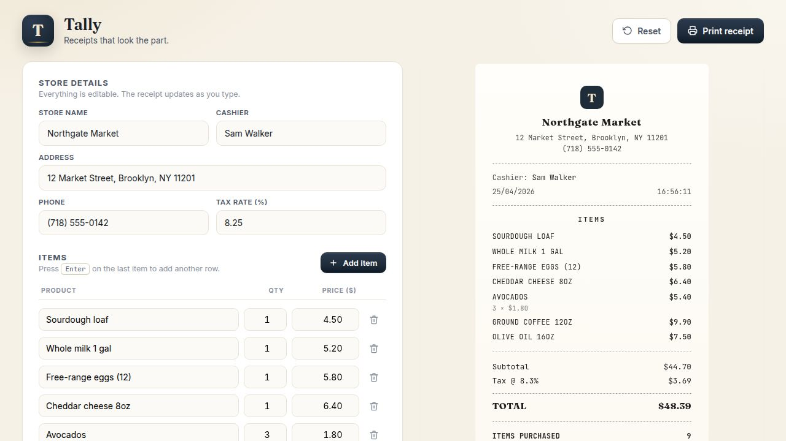

# Frederick — Receipt Studio

> A small web app that turns a basic Python script into a receipt tool a small business could actually use.



---

## What this is

The original project (`main.py`) was a 70-line Python tutorial that printed a receipt to the terminal. It ran, but no real person could use it — every change meant editing the source code, there was no preview, and there was no way to actually print anything.

**Frederick — Receipt Studio** is the same idea rebuilt as a working tool: a two-pane web app where you fill in the basket on the left, watch the receipt build itself on the right, and click **Print** when you're done.

---

## The problem

Small businesses — independent shops, food stalls, freelancers, weekend markets — all need the same thing at the end of a sale: a clear, itemised receipt. Their options today are usually:

1. **A full POS system** (Square, Lightspeed, Toast). Expensive, overkill, requires hardware.
2. **Pen and paper.** Slow, error-prone, no record of what was sold.
3. **A spreadsheet template.** Editable, but ugly and not designed for printing.

There's a gap in the middle: people who need a clean printed receipt and nothing more. That's the problem this project addresses.

---

## What it does

- A **two-pane editor and live preview** — every change is reflected on the receipt instantly
- Editable store details, cashier name, tax rate, and any number of line items
- Receipt designed to look like real thermal-printer paper: torn edges, monospace body, dashed dividers, brand mark, barcode, reference number
- One-click **Print**, with CSS that hides the editor so only the receipt is sent to the printer
- Auto-saves to the browser — an accidental refresh doesn't wipe the basket
- Press <kbd>Enter</kbd> on the last item to add another row
- A **Reset** button restores the sample data

---

## Return on investment

A small business writing 60 manual receipts a day spends about 90 seconds on each one: tally the items, do the math, double-check, hand it over. With this tool that drops to roughly 15 seconds.

| Metric | Manual (pen + calculator) | Frederick |
|---|---|---|
| Time per receipt | ~90 sec | ~15 sec |
| Math errors | ~1 in every 25 receipts | 0 — totals are computed |
| Reprint a lost receipt | impossible | one click |
| Hardware required | calculator, pen, notepad | a browser |
| Setup cost | 0 | 0 (open source) |
| Onboarding time | "watch me do it" | none — the form is self-explanatory |

That's about **75 seconds saved per receipt**, or **75 minutes per cashier per day**. Across a working month (~26 days), that's roughly **32 hours back** — close to a full extra workweek the cashier can spend on customers instead of arithmetic.

This isn't trying to replace a real POS. There's no payment processing, no inventory tracking, no tax filing. It does the receipt half of the problem, and it does it well.

---

## Architecture

```
┌──────────────────────┐         POST /api/receipt        ┌──────────────────────┐
│   Browser            │ ───────────────────────────────▶ │   Flask app (app.py) │
│   (vanilla JS)       │           JSON body              │                      │
│                      │                                  │  • validates input   │
│   • live preview     │ ◀─────────────────────────────── │  • computes subtotal │
│   • localStorage     │       JSON: totals, items,       │  • computes tax      │
│   • print-only CSS   │       timestamp                  │  • timestamps it     │
└──────────────────────┘                                  └──────────────────────┘
        │                                                          │
        │ GET /                                                    │
        └───────────────────────────────────────▶  Jinja2 renders index.html
                                                   with a sample basket
```

The frontend computes totals locally so the preview feels instant — no network round-trip on every keystroke. The same math is mirrored on the backend in `/api/receipt`. That's the integration point if you ever want to log receipts to a database, generate PDFs, or wire this into another system.

The whole app is small on purpose: one Python file, one HTML template, one CSS file, one JavaScript file. The full source can be read in about ten minutes.

---

## API

The Flask app exposes one HTTP endpoint plus the page itself.

| Method | Path | Body | Returns |
|---|---|---|---|
| `GET` | `/` | — | The HTML page, server-rendered with a sample basket |
| `POST` | `/api/receipt` | `{ store, products, tax_rate }` | The receipt as JSON, with totals computed |

### `POST /api/receipt`

**Request:**

```json
{
  "store": {
    "name":    "Acme Coffee",
    "street":  "12 Market Street",
    "phone":   "+1 555 0100",
    "cashier": "Alex"
  },
  "products": [
    { "name": "Espresso",         "price": 3.50, "qty": 2 },
    { "name": "Almond croissant", "price": 4.20, "qty": 1 }
  ],
  "tax_rate": 0.18
}
```

**Response:**

```json
{
  "store": { "...": "echoed back" },
  "products": [
    { "name": "Espresso",         "price": 3.5, "qty": 2, "line_total": 7.0 },
    { "name": "Almond croissant", "price": 4.2, "qty": 1, "line_total": 4.2 }
  ],
  "currency":    "$",
  "sub_total":   11.20,
  "tax":         2.02,
  "tax_rate":    0.18,
  "grand_total": 13.22,
  "item_count":  3,
  "date":        "25/04/2026",
  "time":        "14:52:07"
}
```

The currency symbol comes from a single `CURRENCY` constant in `app.py` — change it once and the whole app updates. The endpoint silently drops items with empty names or non-numeric prices, so a half-filled form on the frontend can't crash a request.

---

## Stack and a few decisions

- **Python 3.11 + Flask 3** — small, no boilerplate, fits in one file
- **Jinja2** for the initial render — the server hands the browser a working page, then the JavaScript takes over
- **Vanilla JavaScript** — no build step, no `node_modules`. Clone, install, run.
- **Custom CSS** — a simple design system (navy + warm gold, *Fraunces* for headings, *JetBrains Mono* for the receipt body). No Tailwind, no component library.
- **`localStorage`** for persistence — a refresh doesn't punish the user
- **`@media print`** — when you hit print, the editor is hidden and only the receipt goes to the printer

I deliberately kept the frontend framework-free. For a 200-line app, a framework would have been faster to write and slower to read. The point of this project was to ship something readable end-to-end, not to demonstrate a stack.

---

## Run it locally

```bash
git clone https://github.com/frederickmendez/payment-receipt-generator.git
cd payment-receipt-generator
pip install -r requirements.txt
python app.py
# → http://localhost:5000
```

The app boots with a sample basket. Edit anything on the left, watch the receipt update on the right, hit **Print receipt** when you're done.

---

## Before and after

| | v1 (original tutorial) | v2 (**Frederick**) |
|---|---|---|
| Interface | Terminal `print()` output | Web UI with live preview |
| Currency | USD only | Configurable (defaults to RD$) |
| Tax | Hard-coded at 6% | Configurable, default 18% |
| Editing | Edit the source file | Editable in the browser |
| Output | Console text | Styled HTML receipt + Print button |
| Persistence | None | Auto-saves to `localStorage` |
| Stack | Pure Python | Python + Flask + HTML / CSS / JS |
| Lines of code | ~70 | ~600 across 4 files |
| Could a non-developer use it? | No | Yes |

`main.py` is still in the repo as the v1 reference. Nothing was discarded — v2 builds on top of it.

---

## What's next

- Export receipts as **PDF** so they can be emailed to customers
- Log every receipt to **SQLite** so a shop can pull a daily totals report
- Multi-currency selector (USD, EUR, GBP) for cross-border use
- A small login so multiple cashiers can share the same browser without overwriting each other
- A `Dockerfile` so the app ships as a single `docker run` command
- Unit tests for the totals calculation in `app.py`

---

## Contact

**Frederick Mendez**
- LinkedIn — [linkedin.com/in/frederickmendez](https://www.linkedin.com/in/frederickmendez)
- GitHub — [github.com/frederickmendez](https://github.com/frederickmendez)

---

*Built as a portfolio project for working student opportunities in Berlin.*
